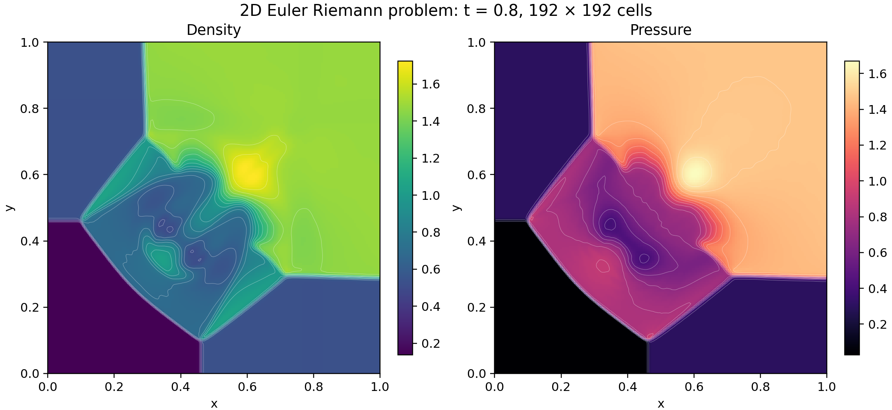
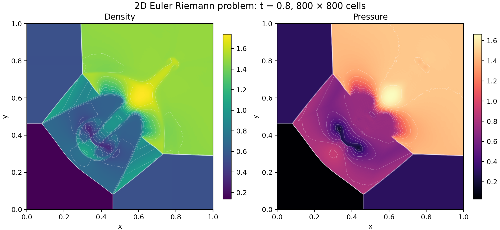

# A reconstructed Euler calculation in proved WebAssembly

A WebAssembly program, compiled from Lean by LeanExe and proved to compute its Lean definition,
evaluates the four-state Euler problem from the [Lanyon
article](https://lanyon.ai/research/euler-equations/).  Initialization, reconstruction, timestep
selection, both directional sweeps, retries, allocation, and final output execute inside one call of
the program.





Both calculations reached time 0.8 with status zero.  On both grids the program returned, bit for
bit, the words recorded at commit `eef07963`, so the figures, CSV files, and ranges below, computed
at that commit from those words, describe this program's results.  The 192 × 192 run took 60.2
seconds and the 800 × 800 run 83.7 minutes, each with eight reconstruction attempts in one Wasmtime
process.

## Problem and method

The domain is the unit square, the initial interfaces are x = y = 0.8, the target time is 0.8, and
the physical ideal-gas parameter is γ = 7/5.

| Quadrant | Pressure | Density | x velocity | y velocity |
|----------|---------:|--------:|-----------:|-----------:|
| Top left | 0.3 | 0.5323 | 1.206 | 0 |
| Top right | 1.5 | 1.5 | 0 | 0 |
| Bottom left | 0.029 | 0.138 | 1.206 | 1.206 |
| Bottom right | 0.3 | 0.5323 | 0 | 1.206 |

Each cell stores density, both momenta, and total energy.  Initialization uses conservative area
averages for cells cut by an interface.  Each directional update reads five cells, reconstructs
three of them, and evaluates Rusanov fluxes at the center cell's two faces.  Neighbor indices clamp
at the domain boundaries.  An x sweep precedes a y sweep.

Reconstruction uses componentwise minmod slopes with a common scale factor.  The program tests both
reconstructed faces for positive density and pressure, halves all four slopes after rejection, and
uses the cell average if eight attempts fail.  Componentwise minmod alone does not preserve positive
pressure: `negative_pressure` in [the counterexample](../Equations/ReconstructionCounterexample.lean)
gives three admissible states whose exact minmod right face has pressure -1/10.  Outward-rounded speed bounds and executable CFL
checks establish dt times grid size times each physical characteristic-speed magnitude ≤ 1/2 at
accepted stages.

The finer grid resolves thinner fronts and more internal structure.  The large-scale front positions
and the high-density region near (0.6, 0.6) resemble the [Lanyon density
figure](https://lanyon.ai/figs/euler-equations/2d-riem-density-final.png).  The 800-grid image shows
finer curved layers than [the first-order calculation](../first-order/800-run/density-pressure.png).
On that grid the density maximum is 1.7392 against 1.6711 for the first-order solver, and the
pressure maximum 1.6635 against 1.6321.  The two solvers differ in reconstruction and in speed
arithmetic.  These are visual and numerical comparisons of the discrete fields.  Each panel uses its
own linear color range.  White curves show interpolated isolines.

## Program and proofs

[The solver](../ReconstructedProgram.lean) states the method in Lean.  Its arithmetic performs, in
the same order, the binary64 operations of the reconstructed solver at commit `eef07963`, whose Lean
model is
[`EulerReconstructed/Control.lean`](https://github.com/jsmorph/leanexe/blob/eef07963d28004e9333876d8ef0673cbe09ff69a/proofs/talos/lean/Project/EulerReconstructed/Control.lean)
with the files it imports.  [The module definition](../Module.lean) compiles it, with [the
first-order solver](../first-order/README.md), into one 23,012-byte module, `euler.wasm`, with
SHA-256 `87efa8a8e63a1e6eda1f6d8a8c668c57e2aeafeaadd4e73c06ac28266b8c794b`.  The theorems below
concern this module and the Lean function `reconstructedSolve`, which packs the result of
`reconstructedRun`.

| Claim | Statement | Theorem |
|-------|-----------|---------|
| Execution | The module's bytes decode to a module whose `reconstructedSolve` export, called with any `n` and trial count from a store that meets the entry conditions of `Implements`, terminates and either returns the words of `reconstructedSolve n trials` or stops at `unreachable`. | `euler_reconstructed_solve` in [the bytes theorems](../Verify.lean) |
| Complete execution and memory | The module's bytes decode to a module whose `reconstructedSolve` export, called with any `n` and trial count from the allocator state of a fresh instance (`top` at the heap base 4096, no free block, 16 pages) under a memory cap of at least 1,407 pages, returns the words of `reconstructedSolve n trials` without stopping at `unreachable` and ends with at most 1,407 pages (88 MiB) of linear memory. | `euler_solve_total` in [the total-execution theorems](../Total.lean) |
| Output | Words with status 0 hold the bits of 0.8, `2 ≤ n ≤ 800`, and `n²` positive, finite densities and pressures. | `reconstructedSolve_ok` in [the run properties](../ReconstructedSpec.lean) |
| Admissibility and hyperbolicity | Words with status 0 pack a final grid whose states have positive density and pressure in exact arithmetic with γ = 7/5.  At each such state the derivative of the flux in every unit direction has a basis of real eigenvectors with eigenvalues `un - c`, `un`, `un`, and `un + c`. | `reconstructedSolve_hyperbolic` in [the hyperbolicity theorems](../Hyperbolic.lean) |
| Speeds and CFL | An accepted outward speed bound is at least the exact `\|u\| + c`.  A run with status 0 is a chain of accepted steps.  Each step advances the time by `dt > 0` with a ratio `r ≥ dt · n`, every state of the grid it starts from is admissible, and `r` times the signal speed of every cell in either direction is at most 1/2. | `speedUpper_ge` in [the enclosures](../Enclosure.lean), `reconstructedRun_steps` in [the step theorems](../Cfl.lean) |
| Conservation | Along that chain, the total of mass, of each momentum, and of energy equals its initial total, minus the boundary fluxes summed over the steps, plus a rounding residual.  The residual is at most a sum of per-update bounds computed from the words of the run. | `reconstructedRun_balance` in [the balance theorems](../ReconstructedBalance.lean) |
| Conservation with exact boundary fluxes | Along the same chain, each total equals its initial total minus the exact Rusanov flux through the boundary, evaluated at the values of the reconstructed boundary face states with the computed speeds, plus a residual.  The residual is at most the sum of the per-update bounds and of bounds on the computed boundary fluxes, all computed from the words of the run. | `reconstructedRun_reference_balance` in [the boundary theorems](../Reference/Boundary.lean) |
| Reconstruction accuracy | An accepted reconstruction returns the cell average or the faces of the factor after some number of halvings of 1/2.  Each face differs from `center ∓ factor · slope`, with the exact minmod slope of the three input states, by at most the rounding radii of the offset and of the face plus the factor times the slope's error, and the faces average to the center up to half the sum of their rounding radii.  When the stencil is linear, its subtractions are exact, the limiter accepts 1/2, and the face arithmetic is exact, the faces are exactly `center ∓ delta / 2`. | `reconstruct_accuracy` and `reconstruct_linear` in [the reconstruction theorems](../ReconstructionAccuracy.lean) |

The proofs use only `propext`, `Classical.choice`, and `Quot.sound`.  Execution relies on Wasmtime
and the hardware implementing the WebAssembly semantics that the proofs model.  The bound of 1,407
pages covers the heap base and three grids of 640,000 cells with their block headers.  The
complete-execution theorem takes the allocator state of a fresh instance as a hypothesis, and no
theorem connects that state to the module's instantiation.  Convergence to a solution of the
continuous Euler equations remains unproved.

## Data

| Grid and summary | Runtime | Density range | Pressure range | Words SHA-256 | Data | Export figures |
|------------------|--------:|--------------:|---------------:|---------------|------|----------------|
| [192 × 192](192-run/summary.json) | 60.2 s | 0.138–1.725103297 | 0.029–1.670588688 | `6304853f…` | [Words](192-run/words.u64le), [CSV](192-run/cells.csv.gz) | [SVG](192-run/density-pressure.svg), [PDF](192-run/density-pressure.pdf) |
| [800 × 800](800-run/summary.json) | 83.7 min | 0.138–1.739211022 | 0.029–1.663523952 | `64ff9d32…` | [Words](800-run/words.u64le), [CSV](800-run/cells.csv.gz) | [SVG](800-run/density-pressure.svg), [PDF](800-run/density-pressure.pdf) |

The runtimes are wall-clock times of one Wasmtime process on a four-core ARM64 Linux machine, with
peak resident sizes of 19 MB and 104 MB.  The 800-grid run shared the machine with Lean proof
checks.  The files of each run directory come from [the run record at commit
`eef07963`](https://github.com/jsmorph/leanexe/blob/eef07963d28004e9333876d8ef0673cbe09ff69a/data/euler-reconstructed-v1/README.md),
where `tools/euler-riemann-complete.js` wrote the words, the CSV file, and the summary of each run,
and `tools/euler-riemann-plot.py` drew the figures from the CSV file.  Each summary file therefore
gives the runtime and SHA-256 of that commit's binary and the names of that commit's theorems.  The
words of this program's runs have the SHA-256 recorded in those summaries.

Reproduction builds the Wasmtime host, emits the module, and runs each grid into a fresh directory.
The run script requires status zero, the word of 0.8, and `4 + 2n²` words, and records the runtime,
the peak resident size, and the SHA-256 of the words.

```sh
tools/build-wasmtime-host.sh
tools/leanrun --lock-timeout 1200 lake env lean --run tools/Emit.lean \
  Examples.Euler.Module Examples.Euler.euler.module euler.wasm
uv run tools/euler-run.py euler.wasm reconstructed 192 new-192-directory
uv run tools/euler-run.py euler.wasm reconstructed 800 new-800-directory
```
