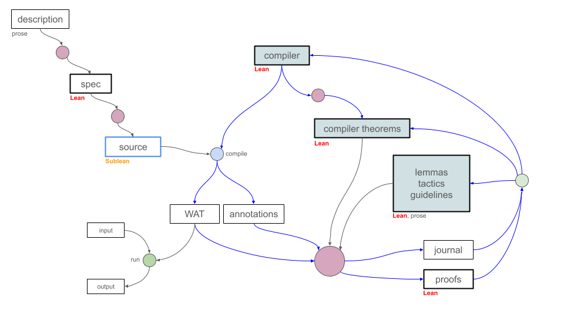

# LeanExe

LeanExe compiles a checked declaration from a restricted Lean 4 program to a standalone WebAssembly module.  The accepted language consists of pure, monomorphic, first-order programs over supported scalar and heap representations, including bounded arrays and internal recursive data.  The [language specification](docs/spec.md) defines that language, while the [user manual](docs/manual.md) explains how to write programs within it.

LeanExe also supports direct verification of an exact WASM artifact.  Its artifact path embeds the binary bytes in Lean, decodes and validates them with checked functions, connects the decoded module to the Talos execution model, and proves a behavioral theorem about that module.  This theorem does not depend on the source program or a compiler-correctness assumption.

Ordinary library-mode binary serialization can also run through LeanExe's experimental [self-hosted WebAssembly emitter](docs/self-hosted-emitter.md).  The native compiler remains the production path; the LeanExe-compiled emitter is a non-blocking deterministic regression experiment.



## Requirements

The compiler and proof workspaces pin exact Lean 4.34.0-rc2 at commit `6a10ac8c22beadecabdbb0919c2b50214762f91d`.  The proof workspace pins the pre-floating-point Talos revision `fda69ca67a81ea4f1fa4e376bdc5861d9fe5479a`; refreshed aggregate proof and conformance gates remain required before this migration supplies release evidence.  The complete execution suite requires Node.js 24.13.0, Wasmtime 44.0.0, a C11 compiler, and `wasm-tools` 1.251.0.  [Developing LeanExe](DEVELOPING.md) defines the setup, process limits, version checks, and required tests.

Run every direct Lean or Lake command through `tools/leanrun`.  The runner
serializes Lean work with the neighboring VQ repository; in standard mode it
also applies the repository's CPU, memory, swap, and thread limits.  Repository
drivers that invoke Lean already use this runner for their child processes.

If a container has no systemd user scope and the user explicitly authorizes
local execution, set `LEANRUN_LOCAL=1`.  This opt-in mode still selects the
pinned toolchain, takes the shared lock, applies the command timeout,
`LEAN_NUM_THREADS=1`, `nice`, and `ionice`, and prints a warning that cgroup
CPU, memory, and swap limits are unavailable.  It never enables itself.  Put
the variable on a runner-calling repository driver instead of wrapping that
driver in `tools/leanrun`, so nested runner calls do not reacquire the lock:

```text
LEANRUN_LOCAL=1 tools/talos-artifact.js prepare <case>
```

```sh
tools/download-wasmtime.sh
tools/leanrun lake build
tools/build-wasmtime-host.sh
node test/run_all.js
```

The self-hosted-emitter experiment is not part of `run_all.js`.  Run
`node test/selfhost_emitter.js` separately only when changing its image boundary.

## Compile and run

The checked [`LeanExe.Examples.Arithmetic.choose`](LeanExe/Examples/Arithmetic.lean) declaration compiles to a scalar WASM export.  Lean remains responsible for parsing, elaboration, type checking, and declaration loading.  LeanExe accepts the declaration only when every reachable runtime term lies in the supported subset.

```lean
namespace LeanExe.Examples.Arithmetic

def choose (x y : UInt64) : UInt64 :=
  if x == 0 then y + 1 else x + y

end LeanExe.Examples.Arithmetic
```

Build the module, compile the selected declaration, and invoke the exported function with Wasmtime:

```sh
tools/leanrun lake build LeanExe.Examples.Arithmetic

tools/leanrun .lake/build/bin/lean-wasm compile \
  --module LeanExe.Examples.Arithmetic \
  --entry LeanExe.Examples.Arithmetic.choose \
  --out build/choose.wasm

build/tools/wasmtime/current/wasmtime run \
  --invoke choose build/choose.wasm 0 41
```

Scalar parameters and results use WASM `i64`.  Arrays, byte arrays, structures, and tagged values use the memory layouts and ownership rules specified in the ABI.  WASI command modes provide bounded stdin, argv, stdout, stderr, and explicit error results while keeping the selected Lean entry pure.

## Generate and verify an artifact proof

`tools/leanexegen` uses separate headless Codex tasks to generate a formal specification, a Lean program, and a proof about the compiled artifact.  Each task may iterate with Lean, while the outer tool independently checks its result.  The proof task receives the frozen specification and exact artifact model but does not receive the source program or compiler implementation.

```sh
tools/leanexegen -o myprogram.wasm myprogram.txt
tools/leanexegen --knowledge knowledge/forest.json -o myprogram.wasm myprogram.txt
tools/leanexegen verify myprogram.proof
tools/leanexegen run myprogram.wasm 10 20 30
```

The public interface for this workflow is `Array UInt64 -> Array UInt64`.  The proof package records the exact binary, decoded model, formal specification, theorem, annotations, selected knowledge packages, journal, and verification results.  The [`leanexegen` reference](docs/leanexegen.md) defines generation, verification, and the optional record, propose, and promote learning phases, while [Verifying a Program](docs/verifying.md) explains the proof boundary.

Completed proof work can produce knowledge artifacts for subsequent work.  `record` preserves a run as a worked example, while `propose` either derives one guidance or checked-support candidate or records that the run supplied no useful entry.  `promote` creates a self-contained forest snapshot after review.  A later generation or reproof selects that snapshot explicitly, and its proof package records the filtered knowledge view together with the entries the proving agent used or rejected.

## Verification boundaries

The source-driven Talos workspace contains twenty registered compiler outputs with input-generic behavioral proofs.  The independent artifact registry contains the same twenty WASM binaries, each with exact-byte identity, decoder and validator results, Talos translation equality, and a behavioral theorem.  [Artifact Verification Format](docs/artifact-format.md) defines the binary packages and release record, [Talos Proofs](proofs/talos/README.md) owns the theorem inventory, and [Development Status](docs/status.md) records the current aggregate state and release blockers.

The knowledge forest selects versioned LTG packages containing checked lemmas, tactics, guidance, and worked examples.  Compiler annotations identify instruction regions and guide entry retrieval, while every generated theorem still checks against the decoded artifact.  [Artifact Proving](docs/artifact-proving.md), [WebAssembly Annotations](docs/annotations.md), and [Knowledge Forest and Structured LTG](docs/ltg.md) describe these components.

## Repository map

| Path | Purpose |
|------|---------|
| `LeanExe/Extract` | Checked-declaration extraction, specialization, ownership analysis, ABI lowering, and IR generation. |
| `LeanExe/IR` | First-order intermediate representation and reference evaluation. |
| `LeanExe/Wasm` | Structured WASM model, emitter, binary encoder, WAT printer, annotations, and compiler-side certificate theorems. |
| `LeanExe/Examples` | Checked source examples used by compiler and execution tests. |
| `test` | Node and Lean tests comparing source, IR, emitted WASM, and runtime behavior. |
| [Talos proofs](proofs/talos/README.md) | Source-driven behavioral proofs, exact-artifact verifier, and shared proof library. |
| [Demonstrations](demos/README.md) | End-to-end generated programs and retained artifact-proof experiments. |
| [Benchmarks](benchmarks/README.md) | Accepted, rejected, and censored proof-generation runs with journals and telemetry. |
| [Core LTG Package](ltg/README.md) | Default versioned retrieval package for proof assets and guidance. |
| [Default Knowledge Forest](knowledge/forest.json) | Default set of knowledge packages selected for proof generation. |
| [Documentation](docs/README.md) | Current user, compiler, verification, proof, and status references. |
| [Plans](plans/README.md) | Detailed plans for unfinished work governed by the root roadmap. |
| [Research papers](paper/README.md) | LaTeX sources, reviewed PDFs, bibliographies, and publication records. |

## Current work

The current repository has twenty completed source-driven and exact-artifact proof cases, eleven current-interface `leanexegen` demonstrations, and the original scalar demonstration.  Demo 12 adds a bounded first-zero search and a variable-length copy-and-shift result over artifact digest `7cdd8adba75d4f076d0a142f824a19a0d34d6a5cedd1a810a417a7fc5789f7b6`.  Its independently verified clean reproof used seven LTG entries without rejection and replaced all local search and copy-loop invariants with `FixedArrayFindIdxEq.program_spec` and `FixedArrayCopy.eraseIdxProgram_spec`.

The reproof took 3,987.145392 seconds in Stage 5 against the 3,907.231311-second baseline, an increase of 2.045 percent, while reducing the proof from 860 to 607 lines, 3,516 to 2,587 words, 39,249 to 28,874 bytes, and 47 to 38 journaled checks.  The journal then produced shared theorems for a dynamic array-header length store and the encoded-index comparison with one.  The retained measurement package keeps the tool pins from that run, while a current-ProofKit re-freeze preserved the artifact digest and passed independent verification after the helper additions.  Erase setup and branch-aware result transfer remain the general proof boundaries, while the [Demo 12 record](demos/demo-12/README.md) preserves the package and detailed comparison.

The checked-in release draft predates the current proof-workspace migration.  Its historical warm-gate receipts do not apply to the new inputs; the aggregate proof and conformance gates, release-record refresh, and cold-checkout gate remain required.  `tools/artifact-release.js check-ready` continues to reject the draft as designed.  [Development Plan](plan.md) is the sole work queue, and `devnotes.md` records decisions and test evidence.
