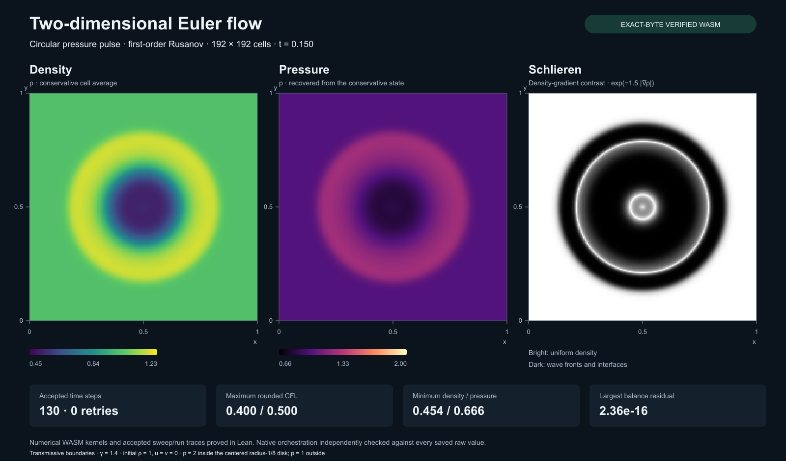

# Two-dimensional Euler flow from verified WASM



Two 192 × 192 finite-volume runs show a circular pressure pulse and a
four-quadrant Riemann problem. Each standalone animation contains 21 saved
snapshots with density, pressure and density-gradient (schlieren) views.
Download the HTML and open it in a browser to play or scrub through time.

| Scenario | Animation | SVG | PNG | Final time | Steps | Max rounded CFL | Largest balance residual |
| --- | --- | --- | --- | ---: | ---: | ---: | ---: |
| Circular pressure pulse | [HTML](pulse.html) | [SVG](pulse.svg) | [PNG](pulse.png) | 0.15 | 130 | 0.400129 | 2.36e-16 |
| Four quadrants | [HTML](quadrants.html) | [SVG](quadrants.svg) | [PNG](quadrants.png) | 0.20 | 165 | 0.400000 | 1.94e-16 |

Both runs have zero retries. Minimum density/pressure across accepted sweep
states are 0.454363/0.665609 for the pulse and 0.25/0.25 for the quadrants.
Balance residual means final minus initial conservative integral plus the
integrated outward boundary flux, for mass, both momenta and energy.

## Verification scope

Every numerical WASM module used has exact-byte execution and accepted-safety
theorems, including rounded intermediate checks. Each frozen package passed
independent artifact verification.

| Module | Bytes | Only called export | Proof |
| --- | ---: | --- | --- |
| Conservative side | 2,212 | sideCheckedBits (5) | [Spec](../../proofs/talos/lean/Project/Euler2DConservative/Spec.lean) |
| Directional flux | 3,514 | fluxCheckedBits (17) | [Spec](../../proofs/talos/lean/Project/Euler2DDynamicFlux/Spec.lean) |
| Directional cell | 5,190 | cellCheckedBits (27) | [Spec](../../proofs/talos/lean/Project/Euler2DCellStep/Spec.lean) |

[summary.json](summary.json) records exact artifact/source digests and full
numerical diagnostics. Public behavior audits use only propext,
Classical.choice and Quot.sound. Exact artifact transfer also uses the
project's existing generated decoder/validator cache witnesses.

The [sweep proof](../../proofs/talos/lean/Project/Euler2DCellStep/Sweep.lean)
proves momentum exchange for the y direction, clamped neighbors, accepted
state safety and actual pointwise cell calls. The
[runner proof](../../proofs/talos/lean/Project/Euler2DCellStep/Runner.lean)
proves successful x/y transitions and arbitrary finite ratio-list call
traces, and certifies both initial grids. Its
[exact-byte transfer](../../proofs/talos/lean/Project/Euler2DCellStep/ArtifactRunner.lean)
applies to the frozen cell module.

Native C/JavaScript grid and timestep orchestration is outside formal proof.
Every saved raw density/pressure word, every final conservative word, every
timestep/controller/diagnostic record and boundary integral is independently
recomputed and compared exactly. This is a guarded discrete computation;
no PDE convergence, entropy-solution or general compiler-correctness claim
is made. The host calls no reset/allocation exports and checks that all
WASM allocation counters stay zero.

## Method and files

First-order Rusanov fluxes, x-then-y splitting, gamma 1.4, transmissive
boundaries, target CFL 0.4. Every accepted cell checks actual rounded CFL
against 0.5 and validates its updated state. Failed proposals discard both
sweeps and halve the timestep; neither run needed a retry.

The unit-square mesh uses conservative cell averages and zero initial
velocity. The pulse starts with density 1 and pressure 2 inside a centered
radius-1/8 disk, pressure 1 outside. Quadrants have density=pressure
0.25/0.4/0.7/1 in lower-left/upper-left/lower-right/upper-right order.
Initial energies and integer pulse geometry are recorded in the summary.

- [raw.json.gz](raw.json.gz): lossless full native event streams, including
  21 density/pressure frames and 147,456 final conservative words per run.
  Words are 16 hexadecimal digits encoding binary64 bits; arrays are
  row-major with physical y increasing upward.
- [cells.csv](cells.csv): final centers, conserved fields, velocities and pressure.
- [history.csv](history.csv): all 295 steps, timestep controls, accepted-state
  diagnostics and boundary flux sums.
- SVG/HTML: lossless embedded cell rasters with fixed color scales across
  frames. Schlieren is exp(-1.5 times the centered density-gradient magnitude),
  using clamped boundary differences. No reconstruction or image smoothing.
- [presentation.json](presentation.json): PNG hashes and renderer versions.
  Posters are presentation derivatives of the canonical SVGs.

## Reproduction

From the repository root on the configured ARM Mac:

```sh
source tools/macos-env.sh
node tools/euler-2d-data.mjs check
```

This reruns both 192² cases through the pinned Wasmtime44 C API, compares
all records to an independent binary64 oracle, and checks all eight
canonical files byte for byte. It passed for this publication. Fresh native
stdout/stderr and content-addressed host build receipts are retained.
The C host uses strict floating-point compiler flags. PNG rasterization is
presentation-only and excluded from the canonical numerical check.

To create the dataset initially, use `write` instead of `check`; it refuses
an existing dataset directory. Retained native records may be supplied only
for an initial write. The focused `node test/euler_2d_runtime.js` checks two
8² runs and rejects deliberate timestep, diagnostic, frame, final-state,
call-count and missing-final corruptions. The execution-policy guard passes.
