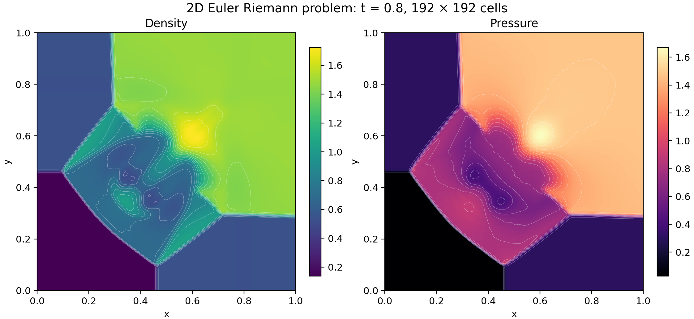

# A reconstructed Euler calculation in proved WebAssembly

A LeanExe-compiled WebAssembly program evaluates the four-state Euler problem from the [Lanyon article](https://lanyon.ai/research/euler-equations/).  Initialization, reconstruction, timestep selection, both directional sweeps, retries, allocation, and final output execute inside one program.



The 192 × 192 calculation reached time 0.8 with status zero in 176.7 seconds.  The 800 × 800 calculation is running.  Both use eight reconstruction attempts and the same proved binary.

## Problem and method

The domain is the unit square, the initial interfaces are x = y = 0.8, the target time is 0.8, and the physical ideal-gas parameter is γ = 7/5.

| Quadrant | Pressure | Density | x velocity | y velocity |
|----------|---------:|--------:|-----------:|-----------:|
| Top left | 0.3 | 0.5323 | 1.206 | 0 |
| Top right | 1.5 | 1.5 | 0 | 0 |
| Bottom left | 0.029 | 0.138 | 1.206 | 1.206 |
| Bottom right | 0.3 | 0.5323 | 0 | 1.206 |

Each cell stores density, both momenta, and total energy.  Initialization uses conservative area averages for cells cut by an interface.  Each directional update reads five cells, reconstructs three of them, and evaluates Rusanov fluxes at the center cell's two faces.  Neighbor indices clamp at the domain boundaries.  An x sweep precedes a y sweep.

Reconstruction uses componentwise minmod slopes with a common scale factor.  The program tests both reconstructed faces for positive density and pressure, halves all four slopes after rejection, and uses the cell average if eight attempts fail.  Outward-rounded speed bounds and executable CFL checks establish dt times grid size times each physical characteristic-speed magnitude ≤ 1/2 at accepted stages.

Compared with the [earlier 192-grid calculation](../euler-riemann-complete-v1/192-run/density-pressure.png), the new density plot shows thinner fronts and more structure in the interaction region.  Its density maximum rises from 1.4901 to 1.7251, and its pressure maximum from 1.4768 to 1.6706.  Reconstruction and the speed bounds both changed.  Each panel uses its own linear color range.  White curves show interpolated isolines.

## Checked claims and data

The [exact-binary theorems](../../proofs/talos/lean/Project/EulerReconstructed/ArtifactTranslation.lean) prove decoding, validation, and complete execution for the frozen 30,726-byte module.  They apply to grid sizes 2 through 800 and every UInt64 reconstruction-trial count.

| Claim | Checked statement |
|-------|-------------------|
| Execution and completion | The solve call terminates, returns the specified words, and uses at most 512 MiB of linear memory.  Status zero establishes the numerical trace through the binary64 encoding of time 0.8.  Explicit failure returns are covered. |
| Positivity and hyperbolicity | Accepted cell and face states have positive physical density and pressure.  The physical directional flux derivative has a complete real eigenbasis. |
| Characteristic speeds and CFL | Outward bounds enclose the physical speeds.  Accepted stages satisfy the exact-real inequalities established by the executable tests. |
| Waves and conservation | The real Rusanov two-wave representation satisfies state-jump and flux-jump identities.  Changes in mass, both momenta, and energy equal boundary fluxes plus bounded rounding residuals throughout the accepted trace. |
| Reconstruction | Real minmod preserves constants, componentwise linear profiles, and reflection symmetry.  Rounded reconstruction has error bounds and a linear-profile theorem with explicit representability and acceptance premises. |

The [detailed proof inventory](../../plans/euler-mathematical-parity.md) records the statements and conditions.  Conservation bounds include update, flux, spacing, and ratio rounding errors.  Proof audits use `propext`, `Classical.choice`, and `Quot.sound`.  Execution relies on Wasmtime and the hardware implementing the modeled WASM semantics.  Convergence to a continuous entropy solution remains unproved.

| Grid and summary | Runtime | Density range | Pressure range | Data | Export figures |
|------------------|--------:|--------------:|---------------:|------|----------------|
| [192 × 192](192-run/summary.json) | 176.7 s | 0.138–1.725103297 | 0.029–1.670588688 | [Words](192-run/words.u64le), [CSV](192-run/cells.csv.gz) | [SVG](192-run/density-pressure.svg), [PDF](192-run/density-pressure.pdf) |

The run script requires status zero, the exact final-time word, matching dimensions, and finite positive density and pressure.  Its monotonic runtime excludes CSV generation and plotting.  Raw words preserve the binary64 fields.  Host code decodes and plots those fields.

Reproduction uses fresh output directories and the installed plotting environment:

```sh
node tools/euler-riemann-complete.js run-reconstructed 192 8 new-192-directory
tools/leanrun --timeout 2m build/tools/riemann-figures-venv/bin/python tools/euler-riemann-plot.py new-192-directory
node tools/euler-riemann-complete.js run-reconstructed 800 8 new-800-directory
tools/leanrun --timeout 2m build/tools/riemann-figures-venv/bin/python tools/euler-riemann-plot.py new-800-directory
```
