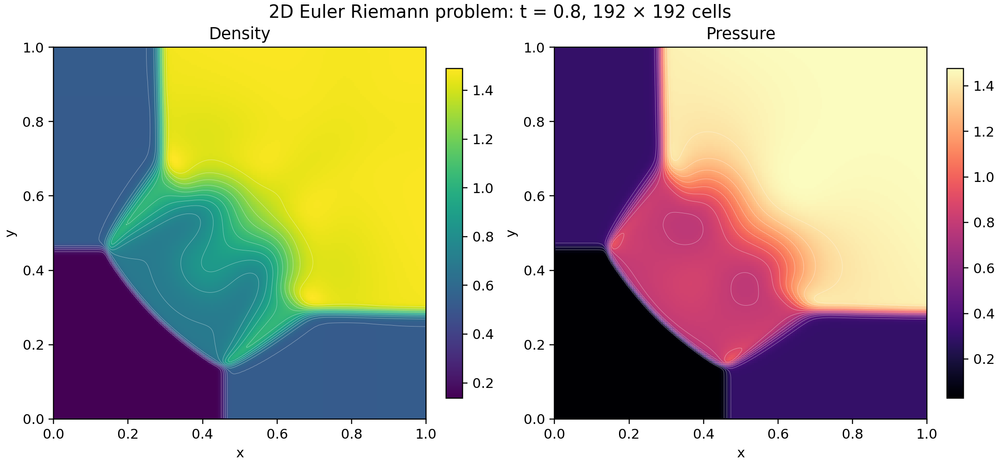
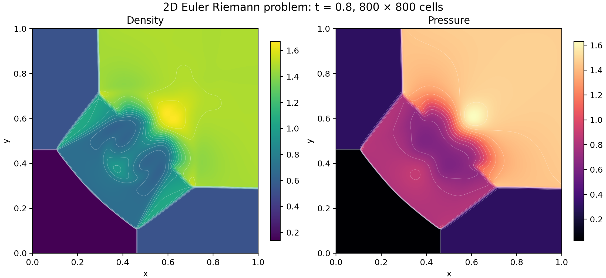

# A four-state Euler calculation in proved WebAssembly

A WebAssembly program, compiled from Lean by LeanExe and proved to compute its Lean definition, evolves the
four-quadrant problem from the [Lanyon Euler article](https://lanyon.ai/research/euler-equations/).
Initialization, timestep selection, both directional sweeps, retries, allocation, and final output
execute inside one call of the program.





The finer grid resolves thinner fronts and a higher central density maximum.  Front positions and the curved interaction region resemble the [Lanyon density figure](https://lanyon.ai/figs/euler-equations/2d-riem-density-final.png).  This comparison is visual.  Colors show cell values, and white curves show interpolated isolines.  Each panel uses its own color range.

## Problem and method

The domain is the unit square, the initial interfaces are x = y = 0.8, the final time is 0.8, and the ideal-gas ratio of specific heats is γ = 1.4.

| Quadrant | Pressure | Density | x velocity | y velocity |
|----------|---------:|--------:|-----------:|-----------:|
| Top left | 0.3 | 0.5323 | 1.206 | 0 |
| Top right | 1.5 | 1.5 | 0 | 0 |
| Bottom left | 0.029 | 0.138 | 1.206 | 1.206 |
| Bottom right | 0.3 | 0.5323 | 0 | 1.206 |

Each cell stores density, both momenta, and total energy.  Cells cut by an initial interface receive conservative area averages.  The first-order finite-volume method uses Rusanov fluxes, an x sweep followed by a y sweep, and transmissive boundaries implemented by clamping neighbor indices.  Timestep selection targets CFL 0.4.  Each accepted cell update checks a rounded ceiling of 0.5.

## Program and proofs

[The solver](../../LeanExe/Examples/Euler.lean) states the method in Lean and follows main's model
of its earlier binary operation for operation.  [The module
definition](../../Project/Euler/Module.lean) compiles it, with [the reconstructed
solver](../euler-reconstructed-v1/README.md), into one 23,012-byte module, `euler.wasm`, with
SHA-256 `87efa8a8e63a1e6eda1f6d8a8c668c57e2aeafeaadd4e73c06ac28266b8c794b`.  On both grids the
program returned, bit for bit, the words of main's earlier binary, so the figures, CSV files, and
ranges below, which main computed from those words, describe this program's results.

| Claim | Statement | Theorem |
|-------|-----------|---------|
| Execution | The module's bytes decode to a module whose `solve` export, called with any `n` from a store that meets the entry conditions of `Implements`, terminates and either returns the words of the Lean function `solve n` or stops at `unreachable`. | `euler_solve` in [the bytes theorems](../../Project/Euler/Verify.lean) |
| Complete execution and memory | The module's bytes decode to a module whose `solve` export, called with any `n` from the allocator state of a fresh instance (`top` at the heap base 4096, no free block, 16 pages) under a memory cap of at least 1,407 pages, returns the words of `solve n` without stopping at `unreachable` and ends with at most 1,407 pages (88 MiB) of linear memory. | `euler_solve_total` in [the total-execution theorems](../../Project/Euler/Total.lean) |
| Output | Words with status 0 hold the bits of 0.8, `2 ≤ n ≤ 800`, and `n²` positive, finite densities and pressures. | `solve_ok` in [the run properties](../../Project/Euler/Spec.lean) |
| Admissibility and hyperbolicity | Words with status 0 pack a final grid whose states have positive density and pressure in exact arithmetic with γ = 7/5.  At each such state the derivative of the flux in every unit direction has a basis of real eigenvectors with eigenvalues `un - c`, `un`, `un`, and `un + c`. | `solve_hyperbolic` in [the hyperbolicity theorems](../../Project/Euler/Hyperbolic.lean) |
| Conservation | A run with status 0 is a chain of accepted steps along which the total of mass, of each momentum, and of energy equals its initial total, minus the boundary fluxes summed over the steps, plus a rounding residual.  The residual is at most a sum of per-update bounds computed from the words of the run. | `run_balance` in [the balance theorems](../../Project/Euler/FirstOrderBalance.lean) |

The proofs use only `propext`, `Classical.choice`, and `Quot.sound`.  Execution relies on
Wasmtime and the hardware implementing the WebAssembly semantics that the proofs model.  Main
proved complete execution with at most 512 MiB of linear memory.  This branch proves it with at
most 1,407 pages: the heap base and three grids of 640,000 cells with their block headers.  The
theorem takes the allocator state of a fresh instance as a hypothesis, and no theorem connects
that state to the module's instantiation.  Main's speed audit found that this solver's rounded signal speed can
underestimate the physical characteristic speed for an admissible input, so no CFL bound in exact
arithmetic is stated for it.  [The reconstructed solver](../euler-reconstructed-v1/README.md) uses
outward speed bounds and has one.  Convergence to a weak solution of the continuous Euler
equations remains unproved.

## Data

| Grid and summary | Runtime | Main's runtime | Density range | Pressure range | Words SHA-256 | Data | Export figures |
|------------------|--------:|---------------:|--------------:|---------------:|---------------|------|----------------|
| [192 × 192](192-run/summary.json) | 16.6 s | 49.6 s | 0.138–1.490131234 | 0.029–1.476780108 | `e097a43d…` | [Words](192-run/words.u64le), [CSV](192-run/cells.csv.gz) | [SVG](192-run/density-pressure.svg), [PDF](192-run/density-pressure.pdf) |
| [800 × 800](800-run/summary.json) | 20.1 min | 61.6 min | 0.138–1.671084032 | 0.029–1.632146140 | `d374cc5c…` | [Words](800-run/words.u64le), [CSV](800-run/cells.csv.gz) | [SVG](800-run/density-pressure.svg), [PDF](800-run/density-pressure.pdf) |

The runtimes are wall-clock times of one Wasmtime process on a four-core ARM64 Linux machine,
with peak resident sizes of 19 MB and 104 MB.  The 800-grid run shared the machine with Lean
proof checks.  The summary files, words, CSV files, and figures are main's.  The words of this program's runs have the SHA-256 recorded in main's summaries.

Reproduction builds the Wasmtime host, emits the module, and runs each grid into a fresh
directory.  The run script requires status zero, the word of 0.8, and `4 + 2n²` words, and
records the runtime, the peak resident size, and the SHA-256 of the words.

```sh
tools/build-wasmtime-host.sh
tools/leanrun --lock-timeout 1200 lake env lean --run Project/Pipeline/Emit.lean \
  Project.Euler.Module Project.Euler.euler.module euler.wasm
uv run tools/euler-run.py euler.wasm first 192 new-192-directory
uv run tools/euler-run.py euler.wasm first 800 new-800-directory
```
