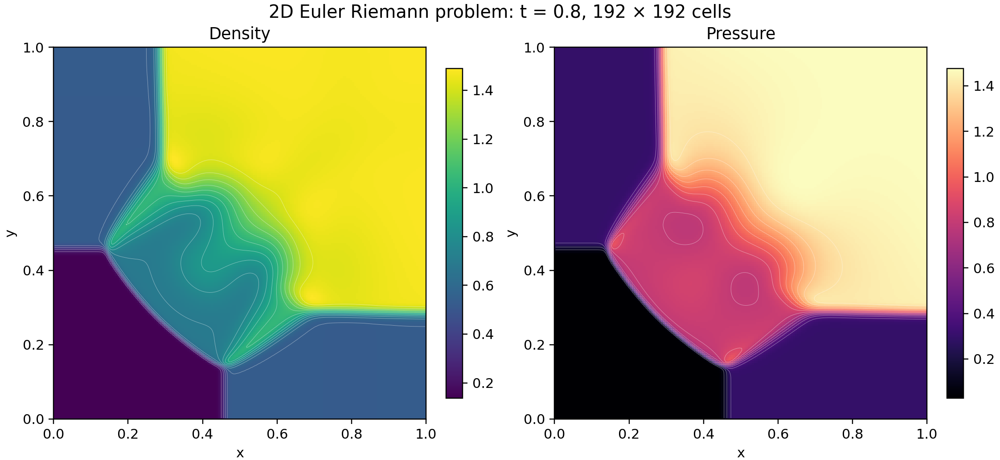

# A four-state Euler Riemann problem

This calculation evolves the four-quadrant problem from the [Lanyon Euler article](https://lanyon.ai/research/euler-equations/) to time 0.8 on a 192 × 192 grid.  LeanExe compiles the numerical kernels from Lean to WebAssembly.  The final density and pressure fields show the interaction of shocks launched by the initial discontinuities.



Colors show cell values.  White curves are interpolated isolines.  Each color bar spans its field's final range.  [SVG figure](density-pressure.svg) and [PDF figure](density-pressure.pdf) preserve the axes and contours for export.

## Initial data and method

The domain is the unit square, with initial interfaces at x = y = 0.8 and ideal-gas ratio of specific heats γ = 1.4.

| Quadrant | Pressure | Density | x velocity | y velocity |
|----------|---------:|--------:|-----------:|-----------:|
| Top left | 0.3 | 0.5323 | 1.206 | 0 |
| Top right | 1.5 | 1.5 | 0 | 0 |
| Bottom left | 0.029 | 0.138 | 1.206 | 1.206 |
| Bottom right | 0.3 | 0.5323 | 0 | 1.206 |

The solver advances density, both momenta, and total energy,

\[
Q=(\rho,\rho u,\rho v,E),\qquad
E=\frac{p}{\gamma-1}+\frac{\rho}{2}(u^2+v^2).
\]

All four states have positive internal energy.  The bottom-left value is 0.0725.  The earlier implementation required both velocity magnitudes to be at most one, excluding three of these states.  The extended guard checks a normalized internal-energy residual against a proved floating-point error bound.

The finite-volume method uses first-order Rusanov fluxes, an x sweep followed by a y sweep, and transmissive boundaries implemented by clamping neighbor indices.  The target CFL is 0.4, and every accepted cell update checks a rounded CFL ceiling of 0.5.  Cells cut by an initial interface contain conservative area averages, retaining the prescribed interface position on this grid.

## Result and verification

The large oblique fronts and their junctions resemble the [published density figure](https://lanyon.ai/figs/euler-equations/2d-riem-density-final.png).  This coarser, first-order calculation has broader central gradients and a lower peak density.  The comparison is qualitative.  Spatial resolution, directional splitting, and numerical diffusion limit the detail represented here.

| Diagnostic | Result |
|------------|-------:|
| Completed timesteps | 808 |
| Rejected timestep attempts | 0 |
| Maximum checked CFL | 0.4003616180 |
| Minimum density over accepted sweeps | 0.138 |
| Minimum pressure over accepted sweeps | 0.02899999999999994 |
| Final density range | 0.138–1.490131234 |
| Final pressure range | 0.029–1.476780108 |
| Largest absolute boundary-corrected balance residual | 4.44 × 10⁻¹⁶ |

The y sweep uses the x-updated state, so its signal speeds can raise the CFL above the timestep target.  The balance residual accounts for flux through the open boundaries for all four conserved quantities.  Total mass and energy can change as fluid crosses those boundaries.  The independent JavaScript calculation agrees with every saved density/pressure word, final conservative word, timestep, diagnostic, and boundary integral from Wasmtime.

Lean checks exact-byte execution and accepted-state safety for all three numerical kernels, plus axis exchange, clamped sweeps, and successful finite-run call traces.  The [cell artifact theorem](../../proofs/talos/lean/Project/Euler2DCellStep/ArtifactRunner.lean) connects those traces to the frozen binary.  Generated decoder and validator cache witnesses retain the repository's native-decide trust boundary.  Native orchestration, initialization, diagnostics, and plotting receive executable tests.  PDE convergence is an open proof obligation.

## Reproduction

The [summary](summary.json) records settings, artifact and source hashes, diagnostics, and data hashes.  [Final cell values](cells.csv), [timestep history](history.csv), and the [compressed raw record](raw.json.gz) include 21 density/pressure snapshots and the complete final conservative state.

The commands in this section use [publication revision 4f0ec1f](https://github.com/jsmorph/leanexe/commit/4f0ec1f161b81a868aac241b248651ca7423bac1), which contains the generators identified by the summary's source hashes.  With the repository's pinned Node 24.13.0, this command replays the saved run and compares all four canonical data files byte for byte:

```sh
tools/leanrun --timeout 10m node tools/euler-riemann-data.mjs check
```

A fresh native run uses the pinned Wasmtime 44.0.0 C API selected by `WASMTIME_C_API`:

```sh
tools/leanrun --timeout 35m node --input-type=module -e \
  "import {run2D} from './tools/euler-2d-runtime.mjs'; console.log(run2D(192,21,'riemann').evidenceDirectory)"
```

The returned directory retains `run.ndjson`.  Passing that file as the final argument to the data check also compares the fresh run with this dataset.  The [plot script](../../tools/euler-riemann-plot.py) and [pinned plotting requirements](../../tools/riemann-plot-requirements.txt) reproduce the figures in a fresh directory containing `cells.csv`.  Both generators preserve existing outputs.
