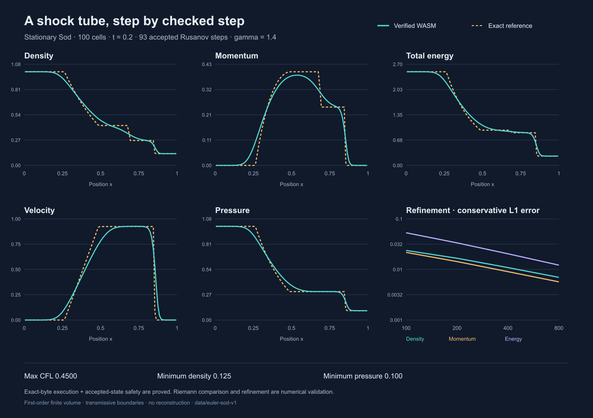

# Checked Sod shock tube

Stationary Sod initial data on [0,1], discontinuity at0.5, gamma1.4,
transmissive boundaries, first-order Rusanov flux, no reconstruction,
100 cells to t=0.2 in93 accepted steps.



[SVG](cell-averages.svg), [final cells](cells.csv), [time history](history.csv),
[refinement](refinement.csv), [raw words](raw.json), [summary](summary.json).

Run from the repository root with the pinned Node environment:

```sh
source tools/macos-env.sh
node tools/euler-sod-data.mjs check
```

The check reexecutes N100/200/400/800 and compares all six canonical text
outputs byte for byte. The write mode exclusively creates absent files; it
never overwrites an existing dataset. The PNG is a reviewed rendering of the
canonical SVG using the desktop-bundled Sharp package, outside the repository
dependencies and formal calculation.

The runtime loads the exact registered grid-scan and grid-step bytes named in
summary.json. It calls only the proved scan, step and reset exports. It grows
step memory before the run, places input beyond all reserved arena objects,
resets allocator globals between steps and copies accepted conservative fields
only. Every step checks status, layout, lengths, counter totals, finite fields,
positive density/pressure/speed, and rounded CFL in(0,0.5]. Every final raw word
for all four resolutions agrees with the independent IEEE host implementation.
Raw100-cell outputs and per-step raw time/ratio/speed words are retained.

[RunnerExecution](../../proofs/talos/lean/Project/EulerGridStep/RunnerExecution.lean)
proves the generic actual-call trace and intermediate-grid safety under the
explicit host-preparation preconditions; [ArtifactRunner](../../proofs/talos/lean/Project/EulerGridStep/ArtifactRunner.lean)
attaches that contract to the frozen bytes. Host time selection, memory growth,
copying, diagnostic accumulation, scientific reference and rendering remain
outside the formal theorem. The runtime assertions check the host obligations;
this does not constitute a formal proof of the JavaScript driver.

The independent exact-Riemann solver uses [Clawpack's Euler relations](https://www.clawpack.org/riemann_book/html/Euler.html),
a bracketed pressure root, analytic rarefaction integrals and shock jump checks.
Errors compare conservative cell averages. Plot velocity/pressure are derived
from those conservative averages; they are not averages of primitive fields.
This stationary Sod case differs from moving-left-state numerical examples.
Boundary fluxes and balance residuals are host diagnostics computed from the
WASM states with the independent flux formula. Refinement and small balance
residuals are scientific validation, not a convergence or entropy theorem.
