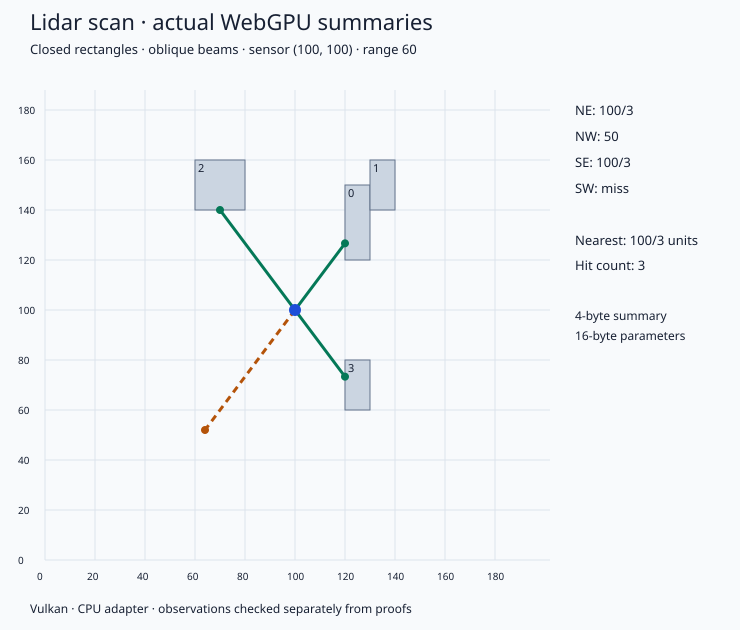
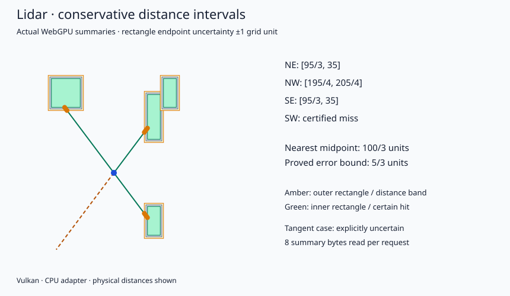

# Deterministic 2D lidar

Lidar is being developed as successive complete Lean → WASM/WGSL → WebGPU
examples. The [development journal](journal.md) records the agenda, figures,
checked results and actual execution evidence.

The exact cardinal and oblique modes use four fixed beams and four closed
axis-aligned rectangles with integer coordinates in `[0,4095]`. One shader
invocation owns one beam result. The scene, directions and results remain in device buffers;
WASM returns a packed parameter word, which the host unpacks into a 16-byte GPU
parameter block. A second shader computes a requested hit-count/nearest-range
summary. The host reads only that 4-byte summary.

Lean proofs connect the application properties to modeled execution of the
actual emitted WASM/WGSL. Host and GPU implementation assumptions are stated
below. Observed execution uses a CPU Vulkan adapter and is separate evidence.


| Mode | Unit directions | Range/result word | Maximum physical range |
|---|---|---|---|
| Cardinal | East, west, north, south | One tick per distance unit | 4095 units |
| Oblique | `(±3/5, ±4/5)` | 60 ticks per distance unit | 68.25 units |

The oblique intersection answers are exact rational distances. For example,
2000 ticks means `100/3` units, with zero arithmetic approximation error.



## Build and run

Use the repository's pinned Lean toolchain and `tools/leanrun` configuration
from [DEVELOPING.md](../../DEVELOPING.md). Install a Vulkan driver on Linux
(`libvulkan1` and `mesa-vulkan-drivers` provide a software adapter on Debian),
or use a supported native WebGPU backend on your platform. Python dependencies
are isolated in an environment:

```sh
uv venv build/lidar/venv
uv pip install --python build/lidar/venv/bin/python -r tools/lidar/requirements.txt
python3 tools/lidar/build.py
build/lidar/venv/bin/python tools/lidar/run.py
python3 tools/lidar/plot.py
```

The demonstration CLIs configure an optional repository-local Vulkan bundle
and restart once when needed, preserving the original Python invocation.
Importing `tools.lidar.run` or the other runners does not restart the process or
change its environment. An embedding application should configure its GPU
library/driver environment before starting Python. Module entry points such as
`python -m tools.lidar.run` are also supported.

Build and run the oblique slice with the same dependencies:

```sh
python3 tools/lidar/build.py --mode oblique
build/lidar/venv/bin/python tools/lidar/run_oblique.py
python3 tools/lidar/plot.py build/lidar/oblique-run.json docs/lidar/figures/oblique.svg
```

Its bundle is `build/lidar/oblique`. Coordinates remain integer grid units;
the range parameter and observed `nearest` field are integer ticks. The evidence
records `ticks_per_unit: 60`, and the figure displays physical distance units.

If local execution without systemd limits has already been authorized, prefix
the build command with `LEANRUN_LOCAL=1`. The build driver uses the repository
runner for every Lean process and checks proofs sequentially. It recognizes the
repository-local pinned toolchain; `LEANRUN_TOOLCHAIN` overrides that selection.

`build/lidar/bundle` contains the emitted shaders, WASM controller, generated
certificates and, after all checks pass, a receipt identifying their bytes.
`build/lidar/run.json` records adapter details, known geometric answers,
observed summaries, transfer counters and artifact digests. Build logs are
under `build/lidar/checks`. The original run is retained in
[evidence/cardinal-run.json](evidence/cardinal-run.json).

The pinned Lean release crashes in its import-memory optimization on the large
compiler proof graph in this environment. [Check.lean](../../tools/lidar/Check.lean)
uses Lean's standard frontend with `leakEnv := false` to avoid that optimization.
It retains ordinary elaboration and kernel checking; the build separately audits
the final theorem dependencies for unexpected axioms and checks that a deliberately
false `1 = 2` theorem is rejected. The wrapper's `unsafe main` accesses Lean's
runtime APIs; it does not supply a logical axiom or bypass proof checking.

## Geometry and requests

Direction IDs follow the order in the mode table (NE, NW, SE, SW for oblique).
A four-bit mask selects which beams
contribute to a summary. The hit count is the number of selected beams that hit
any rectangle within range. The maximum range is inclusive. Tangency counts as a
hit, and an origin inside or on an obstacle returns zero. No selected hit
returns `nearest: null`. The demonstration includes an occluded obstacle,
range-boundary hits, a tangent ray, rejected parameters, and repeated scans with
changing sensor positions and request masks.

The exact modes have no Monte Carlo sampling, sensor noise, trigonometric
approximation, or floating-point shader operations.

## Conservative real-coordinate bounds

**Status: checked end to end.**
The interval mode uses the same four oblique directions and nominal integer
rectangles. Each actual real-valued rectangle endpoint may differ from its
nominal value by at most one grid unit. The sensor position remains exact and
integral. Nominal endpoints must lie in `[1,4094]`; width and height must each
be at least two units. Supplying valid endpoint-error bounds is a precondition;
this example does not infer them from physical measurements.

The GPU traces both the one-unit-expanded and one-unit-contracted scene, then
summarizes each over the requested beam mask. Both sets of per-beam results
remain resident. The host reads two 4-byte summary words:

| Observed bounds | Result | Geometric guarantee |
|---|---|---|
| Outer scene misses | `miss` | Every selected beam misses every allowed real scene within range |
| Inner scene hits | `hit` | Actual nearest selected hit lies in `[lower_ticks/60, upper_ticks/60]` |
| Outer hits; inner misses | `uncertain` | The stated uncertainty permits an unresolved boundary case |

For a certified hit, the reported midpoint error is at most
`(upper_ticks - lower_ticks)/120` physical units. The host formats these rational
quantities exactly using integer fractions. An uncertain result has no midpoint
or claimed finite hit-distance error. The requested maximum range remains
inclusive. With an empty mask the result is a miss over the empty set of beams.

The new numerical error is explicitly bounded **input representation error**;
GPU arithmetic still has zero error on the stated domain. The one-unit bound
is deterministic and has no random/noise interpretation. Near a corner tangent
or a range edge, uncertainty is an intended result.

The interval bundle and demonstration use:

```sh
python3 tools/lidar/build.py --mode interval
build/lidar/venv/bin/python tools/lidar/run_interval.py
python3 tools/lidar/plot_interval.py
```

Its bundle is `build/lidar/interval`; its observed results are written to
`build/lidar/interval-run.json`. The mask and parameter encoding are shared
with the exact modes. All 12 [recorded comparisons](evidence/interval-run.json),
three invalid-parameter checks and three invalid-scene checks pass. The final
artifact-connected theorem and its axiom audit also pass.



## Repeated requests

**Status: checked and exercised across all three modes.** A mask-only update reuses the
resident beam results and runs only the summary shader (two summaries in interval
mode). Changing sensor position or maximum range forces a new scan. Creating a
new runner supplies a new scene; its first request always scans. Calls to a
runner are serialized.

The parameter-dependency proof applies to the emitted scan artifacts. The host's
cache invalidation and scheduling remain explicit implementation obligations.
A failed submission/readback clears the completed-pose marker, while a WASM
rejection occurs before any GPU update. Each successful query still uploads
16 parameter bytes and reads 4 or 8 summary bytes. Counters describe successfully
completed requests: `queries` counts them all,
while `scans` counts those that freshly compute beam results.

After building all three modes, run the stream comparisons with:

```sh
build/lidar/venv/bin/python tools/lidar/run_stream.py
```

All 33 [recorded requests](evidence/stream-run.json) pass, including exact
per-request dispatch/transfer expectations. Each mode executes five fresh scans
for eleven requests, while six requests reuse results. Cardinal and oblique
read 44 summary bytes each; interval reads 88. Three invalid-mask updates are
rejected without changing transfer counters. The original 38 geometric
comparisons also pass with reuse enabled.

## What the proofs cover

Milestone 1 is complete: geometry, integer arithmetic, parameter packing,
summary formula, exact WGSL certificates, exact WASM controller proofs and
artifact-identity checks have passed. The identified artifacts pass all 12
geometric cases and three invalid-parameter checks on software WebGPU.
Those observed runs remain separate evidence from the universal proofs.
Milestone 2 also passes its oblique geometric/arithmetic proofs, exact artifact
checks and 14 observed comparisons; its [run evidence](evidence/oblique-run.json)
includes fractional intersections, reflected directions and corner tangency.

- [Cardinal geometry](../../proofs/talos/lean/Project/Lidar/Cardinal.lean) proves
  nearest-hit selection and the miss characterization for any valid rectangle
  list in the cardinal model.
- [Continuous geometry](../../proofs/talos/lean/Project/Lidar/Continuous.lean)
  interprets those integer answers along real-valued rays and relates reflected
  coordinates to ordinary Cartesian rectangle membership.
- [Integer arithmetic](../../LeanExe/WGSL/UInt.lean) proves zero numerical error
  between mathematical expressions and modeled `u32` evaluation when its bound
  checker accepts the expression and inputs satisfy the stated bounds.
- [Shader composition](../../proofs/talos/lean/Project/Lidar/Shader.lean) connects
  the lidar expression and a certificate for emitted shader statements to the
  continuous nearest-hit property. The accepted grammar has immutable inputs,
  a lane guard and a single lane-owned output write.
- [Controller packing](../../proofs/talos/lean/Project/Lidar/Controller.lean)
  proves bounded parameter packing, rejection and exact field extraction. The
  generated controller certificate uses the arithmetic compiler theorem for
  emitted WASM bytes, decoding, validation and modeled execution.
  [The return-value theorem](../../tools/lidar/ControllerResult.lean) connects
  the exact decoded WASM call to the native Lean packing/rejection function.
- [The pipeline theorem](../../tools/lidar/Application.lean) composes that WASM
  result, the unpacked parameter fields, all four scan lanes, the exact summary
  shader and host count/nearest decoding in one statement.
- [Exact requested summaries](../../proofs/talos/lean/Project/Lidar/ExactQuery.lean)
  prove that the decoded count equals the number of selected beams intersecting
  geometry within range. The decoded nearest distance is the first selected
  geometric hit; `none` (JSON `null`) occurs exactly when no selected beam hits
  within range. Both exact pipeline theorems use this shared composition.
- [Oblique geometry](../../proofs/talos/lean/Project/Lidar/Oblique.lean) proves
  unit direction vectors and continuous nearest intersections at the 60-tick
  scale. [Its pipeline theorem](../../tools/lidar/ObliqueApplication.lean)
  connects the emitted oblique scan and summary shaders, decoded results, and
  the same emitted WASM controller. Distances remain in 60-tick units.
- [Real-scene enclosure](../../proofs/talos/lean/Project/Lidar/IntervalBounds.lean)
  proves inclusion between the inner, actual, and outer scenes.
  [Interval geometry](../../proofs/talos/lean/Project/Lidar/Interval.lean) proves
  existence of a nearest real hit and the conservative midpoint error bound.
- [Requested interval summaries](../../proofs/talos/lean/Project/Lidar/IntervalQuery.lean)
  connect the per-beam calculations to the nearest selected hit.
  [The interval pipeline](../../tools/lidar/IntervalApplication.lean) connects
  that contract to both emitted scans, summary-word decoding, and emitted WASM.
- [Parameter stability](../../LeanExe/WGSL/UIntStability.lean) proves that changes
  outside a checked parameter prefix preserve the scan's modeled `u32` result.
  Each bundle's generated `Stream.lean` connects this to its exact scan shader.

The artifact checks and the observed runs are separate evidence. Consult the
journal for which checks have completed at the current development milestone.

Run the import/CLI and artifact-boundary regression checks with the runtime
dependencies installed:

```sh
build/lidar/venv/bin/python -m unittest discover -s tools/lidar -p 'test_*.py'
```

## Host and arithmetic assumptions

The WGSL proof uses the narrow integer statement model, not a formalization of
every WGSL feature or a verified GPU driver. WebGPU must implement the accepted
`u32` operations and accesses, run the requested lanes to completion, and honor
buffer visibility between dispatches. The model follows WGSL's
[32-bit unsigned integer semantics](https://www.w3.org/TR/WGSL/#integer-types),
including modulo `2^32` arithmetic; the checked bounds prove that wrapping does
not occur on the stated domain. Subtraction is explicitly saturated by
`max(a,b)-b`. No floating-point profile is needed for these modes. The
WASM engine must implement the modeled 64-bit integer semantics. The packed
valid result fits in 40 bits; the rejected all-ones result is received as `-1`
through Wasmtime's signed host representation.

The native host is responsible for validating rectangle ordering and bounds,
loading the identified artifacts, transferring words without changing their
values, binding the declared buffers, maintaining distinct output storage, and
ensuring the resident scan matches the current pose/range before its summary.
Allocation success, filesystem identity
checks, Python bindings, the driver, operating system and hardware are external
assumptions. The exact modes model integer scenes. The interval mode quantifies
over all real scenes satisfying its endpoint-error precondition. Neither supplies a
model of physical sensor calibration, measurement errors outside that bound,
or real terrain.

The recorded execution used **Mesa llvmpipe through Vulkan, a CPU WebGPU
adapter**. It establishes observed agreement on the recorded cases, not
universal GPU conformance or hardware-GPU performance.
