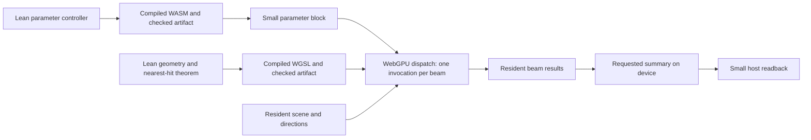
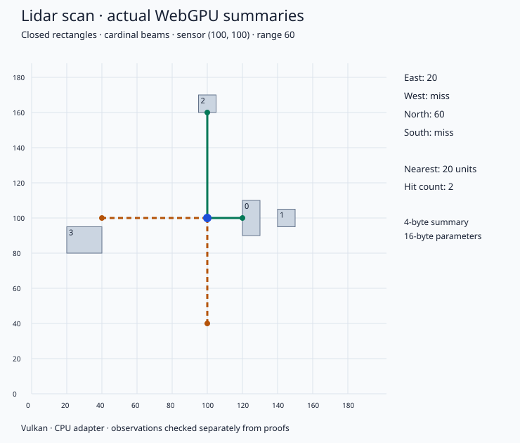
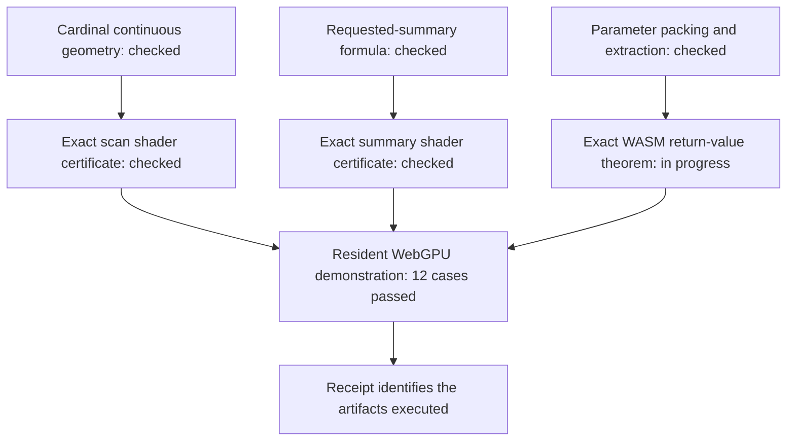

# Lidar development journal

A running lab notebook for deterministic 2D lidar in LeanExe. Entries record the
agenda, mathematical results, emitted artifacts, and observed runs. Routine
compiler diagnostics stay in ignored build logs.

## Agenda

| Milestone | Complete slice | Status |
|---|---|---|
| 1 | Four cardinal beams, bounded integer rectangles, nearest-hit proof, emitted WASM/WGSL, resident WebGPU execution and compact summary | Complete |
| 2 | Fixed oblique directions, exact intersection specification, numerical bounds, compiled execution and geometric comparisons | In progress |
| 3 | Broader numerical domain, certified hit/miss/uncertain results, conservative nearest-range bounds | Planned |
| 4 | Repeated scans, parameter updates, requested summaries, stale-result and transfer checks | Planned |

A milestone is complete only when its application theorem, artifact connection,
executed demonstration, and build/run instructions agree on the same scope.

## 2026-09-26 — Starting with a complete small scan

The `lidar` branch starts at `fb8cd5da` on `main`. The existing GPT/WGSL work
is on `origin/wgsl` at `9c7c7898`. Its narrow compiler, independent shader parser,
and explicit host contracts provide the architectural precedent. Its floating
point body grammar lacks comparisons and branches, so lidar needs a small
integer geometry extension. We will bring over only the foundation we use.

The first domain uses four cardinal beams, closed axis-aligned rectangles,
integer coordinates and bounded integer ranges. Tangency counts as a hit;
an origin inside an obstacle returns zero; maximum range is inclusive.
The returned value is a distance; equal-distance obstacles share that answer.

The first scan must exercise a nearer obstacle hiding a farther one, a miss,
and an inclusive boundary. The arithmetic target is zero error on the bounded
integer domain. Tests will report the actual WebGPU adapter; software WebGPU
execution will be labelled as such. No hardware GPU is currently exposed at
`/dev/dri` in this environment.

**Starting evidence:** branch created and existing GPU architecture inspected.
No lidar theorem, emitted artifact, or WebGPU run is claimed yet.

## First scan runs through WASM and WebGPU

The source nearest-hit and miss theorems now check for every valid rectangle
list in the cardinal integer model. The integer shader expression has a checked
zero-error correspondence theorem on bounded words, composed with the geometric
specification. Its exact emitted-text certificate is being checked separately.

The first resident scan runs on Mesa llvmpipe (LLVM 19.1.7), a **CPU Vulkan
adapter accessed through WebGPU**. Known geometric cases cover occlusion,
inclusive range, a tangent ray, an occupied origin, misses, request masks, and
a return to the original pose after intervening scans. The scene and directions
are uploaded once. Each scan supplies 16 parameter bytes from a compiled WASM
controller and reads back one 4-byte GPU-computed count/nearest summary.

The figure is generated from per-direction requested summaries, not a CPU
ray-tracing implementation. The gray rectangles are the uploaded scene; solid
green rays hit and dashed amber rays reach the range limit without a hit.
The east beam selects the nearer of two obstacles. The north hit is exactly
on the range boundary.

**Status at this stage:** executable path achieved; exact artifact certificates,
continuous geometric interpretation, and reproducible package checks still
need closure before milestone 1 is declared complete.

### Proof closure and the next slice

The cardinal result now ranges over continuous real-valued rays. Reflection
into the bounded coordinate box is proved equivalent to ordinary Cartesian
rectangle membership, and the shader expression is connected to that theorem.
The controller's packed word and the host's four field extractions also have
checked proofs.

Artifact certificates are checked one small group of shader statements at a
time. This gives the checking process manageable boundaries while preserving
exact emitted text as the proof subject. The source build driver records each
check separately.

For the oblique slice, the chosen fixed directions will include the rational
unit vectors `(3/5,4/5)` and their reflections. With integer rectangle corners,
intersection distances have an exact common integer scale. This supports an
oblique scan before introducing approximation into the output representation;
the latter can then carry a useful explicit rounding bound.

### Artifact identity and controller behavior

The scan and summary shader certificates now pass Lean's kernel checks. The
runtime loads the bytes once, checks their digests against the build receipt,
and executes those same bytes. Fault-injection checks reject changed shaders,
changed WASM and a missing receipt. Parser checks reject invalid buffer indices,
undefined references, duplicate locals and a write to a different lane.

The controller is small enough for the general arithmetic compiler's binary
theorem. We are also closing a more explicit application connection: the exact
decoded WASM call must return the native Lean parameter-packing function's
result, including rejection. Merely displaying the application theorem and the
compiler theorem next to one another would obscure that connection.

One integration lesson affects the shared compiler proof: structured WASM
branches now carry result-type annotations in the interpreter model. The
scalar translation must preserve the `i64` and `i32` annotations used by its
execution proofs. This is being repaired and checked at the shared boundary,
so the lidar controller can reuse the normal compiler theorem.

The pinned Lean release also crashes when marking this large imported proof
environment as permanent. A minimal import-only reproduction and debugger trace
located that failure before command checking. The artifact driver uses Lean's
standard frontend with `leakEnv := false`; elaboration, kernel checking and axiom
audits remain in place. This is a toolchain workaround, not an additional
mathematical assumption or a substitute for completing the controller proofs.

### Controller proof connection completed

The emitted WASM bytes now have both the compiler correctness certificate and
the application result theorem: for every `UInt64` argument tuple, modeled
execution of the decoded `parameters` export terminates with exactly the
native Lean packing/rejection function's value. The final application module
checks this alongside the exact scan and summary shader certificates. Axiom
audits report only `propext`, `Classical.choice`, and `Quot.sound`.

The import wrapper also rejects a deliberately false `1 = 2` theorem. Its
`unsafe` entry point calls Lean runtime APIs; it does not add a mathematical
axiom. The documented build is now being exercised in a fresh output directory.
Shader certificates import only the small integer compiler; the geometric
library is brought in at the final application connection.

The next slice uses 60 ticks per distance unit for directions `(±3/5, ±4/5)`.
One unit of x displacement costs 100 ticks; one unit of y displacement costs
75 ticks. Keeping the controller range word in `[0,4095]` ticks lets this slice
reuse the proven parameter controller and summary encoding. The physical range
is then at most `4095/60 = 68.25` distance units. That change of units must be
visible in the run evidence and figures.

### Milestone 1 — checked end to end

All component certificates and the final application module have passed.
`Application.pipeline` now states the connection explicitly: the identified
WASM export returns a word whose unpacked fields supply the identified shader,
and that shader's modeled result is the continuous nearest intersection or a
correct miss. The requested-summary theorem checks the second shader's result.
Serializing the theorem-named values and comparing their bytes also passes.

The receipt-checked WebGPU rerun passes all 12 geometric cases and three invalid
parameter checks. Its [retained evidence](evidence/cardinal-run.json) identifies
the actual artifacts and CPU Vulkan adapter. The scene and directions are
uploaded once (64 and 16 bytes); 12 scans upload 192 parameter bytes and read
48 summary bytes in total. No per-beam result buffer is read back.

The false-theorem rejection check, artifact mutation checks and documentation
link check also pass. This completes the first small slice; the oblique source
and geometric proof are now under development. Their completion will require
their own checked artifact and executed comparisons.
